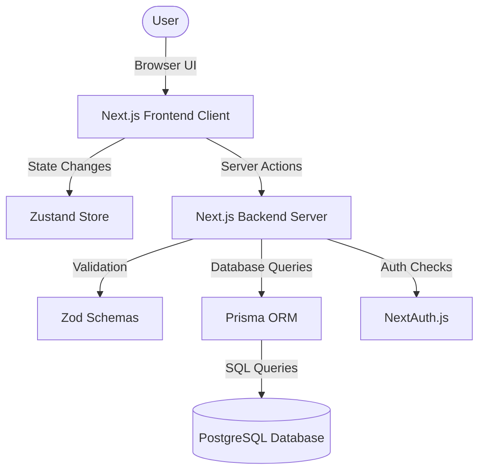
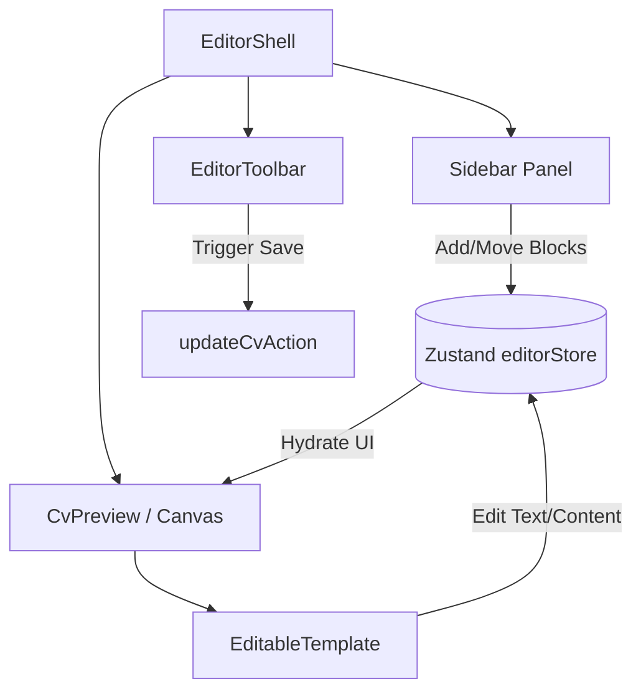
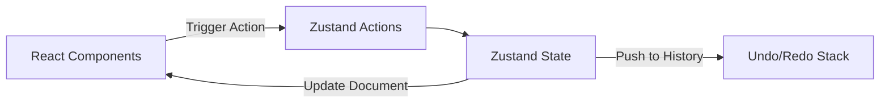
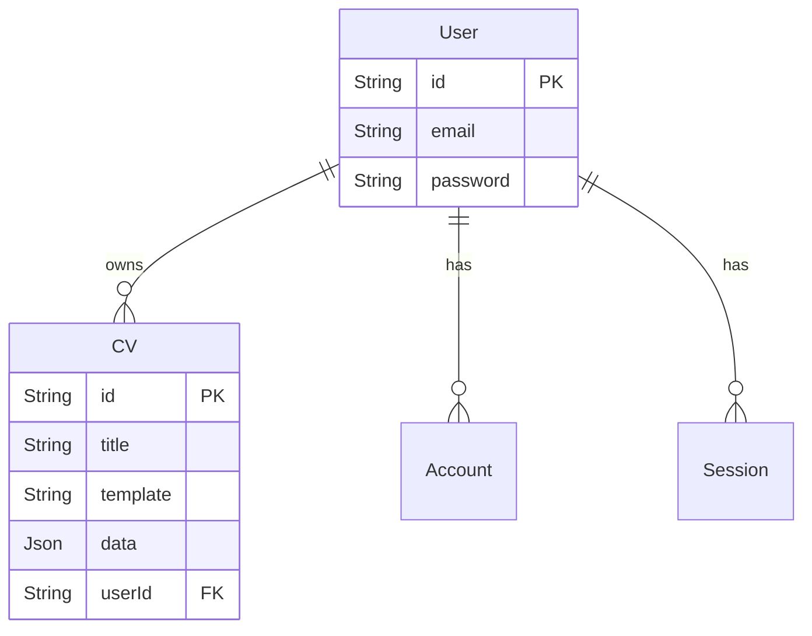
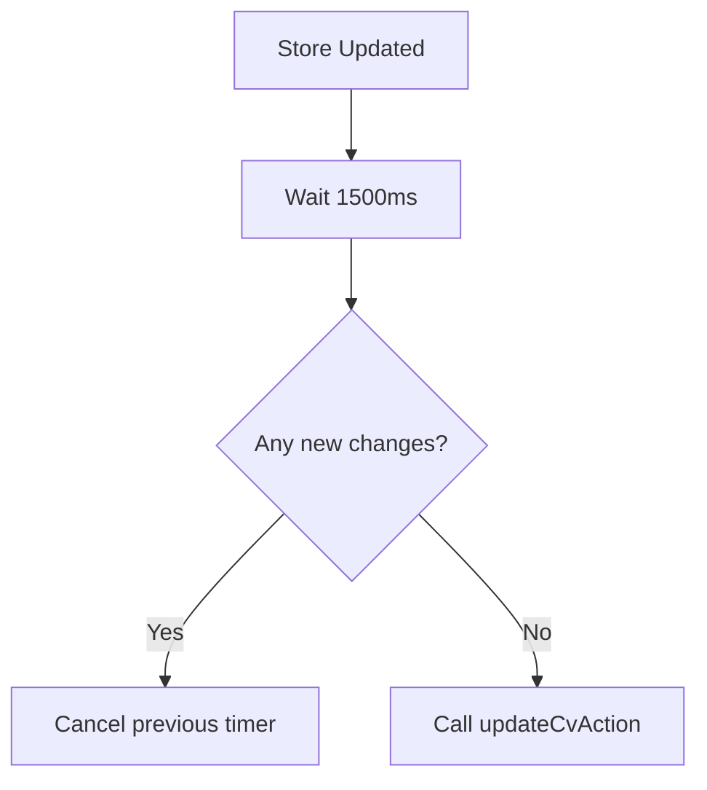
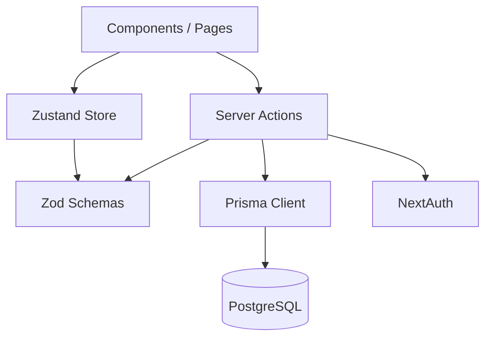

# CV Builder Architecture Documentation

System: CV Builder  
Frontend: Next.js (App Router), React 19, Tailwind CSS  
State: Zustand (Client-side)  
Backend: Next.js Server Actions & API Routes  
Database: PostgreSQL via Prisma ORM  
Authentication: NextAuth.js (Auth.js) v5  
PDF Export: Native Browser Print (`window.print()`)  
Main Architecture: Fullstack Serverless Monolith (Next.js) with a block-based WYSIWYG Editor.

---

## 1. Project Overview

**Project Name:** CV Builder  
**Project Purpose:** A web-based application that allows users to create, customize, and export professional resumes (CVs).  
**Target Users:** Job seekers, professionals, and students needing to generate well-formatted CVs quickly.  
**Core Features:** 
- Block-based visual editor with drag-and-drop support.
- Live preview rendering (WYSIWYG).
- Customizable templates and themes.
- User authentication and CV management dashboard.
- High-fidelity PDF export.
**Current Development Status:** Active Development / MVP Phase. Core editor, templates, authentication, and database persistence are implemented.

---

## 2. Technology Stack

| Technology | Version | Purpose | Where Used |
| :--- | :--- | :--- | :--- |
| **Next.js** | 16.2.9 | Full-stack framework (App Router) | Entire Application |
| **React** | 19.2.4 | UI Library | Frontend / Client Components |
| **TypeScript** | ^5 | Type Safety | All Codebase |
| **TailwindCSS** | ^3.4.19 | Styling & UI Design | Global & Component Styles |
| **Zustand** | ^5.0.14 | State Management | CV Editor State (`editorStore.ts`) |
| **Prisma** | ^7.8.0 | ORM / Database Client | Server Actions / API Routes |
| **PostgreSQL** | (via pg) | Relational Database | Data Persistence |
| **NextAuth.js** | ^5.0.0-beta.31 | Authentication | `auth.ts`, Middleware, Server Actions |
| **@dnd-kit/core** | ^6.3.1 | Drag and Drop logic | Block sorting in Editor |
| **Zod** | ^4.4.3 | Schema Validation | API inputs, Block definitions |
| **Bcryptjs** | ^3.0.3 | Password Hashing | Auth credentials provider |

---

## 3. High Level Architecture



**Layers Explanation:**
- **Frontend Client (React/Tailwind):** Handles all visual rendering, user interactions, drag-and-drop, and editable UI blocks.
- **State Management (Zustand):** Manages the in-memory state of the CV document being edited, including Undo/Redo history.
- **Backend (Next.js Server Actions):** Handles data mutations, fetching, and business logic without exposing API endpoints directly.
- **Database (Prisma/PostgreSQL):** Stores User accounts, Sessions, and CV Documents (stored as JSON objects).
- **Authentication (NextAuth):** Secures the application, enforcing session requirements before data access.

---

## 4. Repository Structure

```text
project/
├── app/                  # Next.js App Router (Pages, Layouts, API Routes, Global CSS)
├── components/           # Reusable React Components
│   └── editor/           # Core CV Editor UI (Toolbar, Sidebar, Canvas, Templates)
├── lib/                  # Utilities, Actions, Stores, Hooks, Schemas
│   ├── actions/          # Next.js Server Actions (Database mutations)
│   ├── blocks/           # Default block data and CV Template definitions
│   ├── hooks/            # Custom React hooks (e.g., useAutoFit)
│   ├── schemas/          # Zod validation schemas (Document, Block, CV, User)
│   └── stores/           # Zustand state management
├── prisma/               # Database schema and migrations
└── public/               # Static assets (images, icons)
```

- **`app/`**: Entry points for routing.
- **`components/editor/`**: Contains the complex, client-heavy logic for the CV Builder.
- **`lib/schemas/`**: Critical for ensuring data integrity between Client, Store, and Database.
- **`lib/stores/`**: Holds `editorStore.ts`, the heart of the application's client state.

---

## 5. Frontend Architecture

The frontend strictly follows the Next.js App Router paradigm, dividing components into **Server Components** (default) and **Client Components** (`"use client"`).

**Component Hierarchy:**
```text
Page (Server Component, e.g., app/editor/[id]/page.tsx)
↓ Fetch Initial CV Data from DB
↓ Client Boundary ("use client")
EditorShell (Client Component)
├── EditorToolbar (Actions: Save, Export, Undo)
├── Sidebar (Block Structure, Settings, Templates)
└── CvPreview (Canvas Wrapper)
    └── EditableTemplate (Renders blocks based on document layout)
        ├── SectionTitle
        ├── E (Editable text field wrapper)
        └── Block UI (Timeline, Skills, Tags, etc.)
```

Client state is decoupled from React Context, using Zustand for performance (preventing unnecessary re-renders).

---

## 6. CV Editor Architecture

The CV Editor is the core feature. It is a block-based WYSIWYG editor.



- **Toolbar:** Manages document-level actions (Save, Print PDF, Undo/Redo).
- **Sidebar:** Allows users to add, reorder, duplicate, and delete blocks. Uses `@dnd-kit` for drag-and-drop reordering.
- **Canvas (`CvPreview`):** A fixed-size A4 container (`210mm x 297mm`) that renders the CV.
- **EditableTemplate:** Iterates through `document.columns` and renders blocks dynamically based on `block.type`.
- **Text Editing:** Uses an inline `contentEditable` wrapper (`<E />`) to allow direct text manipulation on the canvas.

---

## 7. Block System

The document is built using predefined blocks.

| Block Type | Component | Schema | Default Data | File |
| :--- | :--- | :--- | :--- | :--- |
| `header` | Inline in `EditableTemplate` | `HeaderBlockData` | Avatar, Name, Title, Contacts | `block.schema.ts` |
| `text` | Inline in `EditableTemplate` | `TextBlockData` | Summary / Objective text | `block.schema.ts` |
| `timeline` | Inline in `EditableTemplate` | `TimelineBlockData` | Experience, Education items | `block.schema.ts` |
| `skills` | Inline in `EditableTemplate` | `SkillsBlockData` | Skill name, Level (0-100) | `block.schema.ts` |
| `tags` | Inline in `EditableTemplate` | `TagsBlockData` | Array of strings | `block.schema.ts` |
| `links` | Inline in `EditableTemplate` | `LinksBlockData` | URLs, Labels | `block.schema.ts` |
| `divider` | Inline in `EditableTemplate` | `DividerBlockData` | Line style (solid, dashed) | `block.schema.ts` |
| `spacer` | Inline in `EditableTemplate` | `SpacerBlockData` | Height in px | `block.schema.ts` |

**Developer Guide to add a new block:**
1. Add type to `BlockType` enum in `lib/schemas/block.schema.ts`.
2. Create Zod schema (e.g., `NewBlockData`).
3. Add to `BlockSchema` discriminated union.
4. Add default block data to `createDefaultBlock` in `lib/blocks/default.ts`.
5. Implement rendering logic in the `switch (block.type)` statement inside `EditableTemplate.tsx`.

---

## 8. Document Model

The CV is stored as a hierarchical JSON structure defined by Zod schemas in `lib/schemas/block.schema.ts`.

```text
CvDocument
├── layout: "single" | "two-column" | "sidebar-left" | "harvard"
├── theme
│   ├── primaryColor
│   ├── fontFamily
│   └── fontSize
└── columns (Array)
    └── Column
        ├── id
        ├── width
        └── blocks (Array)
            └── Block
                ├── id
                ├── type ("header" | "timeline" | ...)
                ├── label
                └── data (Block-specific payload)
```

**Important Files:**
- `lib/schemas/block.schema.ts` (Core definitions)
- `prisma/schema.prisma` (Database persistence as `Json` field)

---

## 9. State Management

The application utilizes Zustand for client-side state management, centralizing the CV Document state.



**State Location:** `lib/stores/editorStore.ts`
**Key States:**
- `document`: The current `CvDocument` object.
- `past` / `future`: Arrays of `CvDocument` for Undo/Redo logic.
- `saved` / `saving`: Status flags for database synchronization.
- `cvId`, `title`, `templateName`: Metadata.

**Key Actions:**
- `updateDocument(updater)`: Core mutator that also handles pushing the previous state to the `past` array.
- `addBlock`, `removeBlock`, `moveBlock`, `updateBlock`: Helpers for specific document mutations.

---

## 10. Data Flow

**Save CV Flow:**
```text
User triggers Save (or Autosave)
↓
UI calls Server Action `updateCvAction(id, document)`
↓
Server Action validates session via `auth()`
↓
Server Action parses data via `CvDocumentSchema.parse()`
↓
Prisma updates `CV` record in PostgreSQL
```

**Load CV Flow:**
```text
User navigates to `/editor/[id]`
↓
Next.js Server Component calls `getCvAction(id)`
↓
Server validates Auth and fetches CV from Prisma
↓
Server passes CV JSON to `EditorShell` (Client Component)
↓
`EditorShell` calls `useEditorStore.getState().loadDocument(cv)`
↓
UI Renders Document
```

---

## 11. Server Architecture

Backend logic is primarily handled via Next.js Server Actions, eliminating the need for boilerplate API routes.

| Function | File | Responsibility | Input Validation | Authorization |
| :--- | :--- | :--- | :--- | :--- |
| `createCvAction` | `lib/actions/cv.ts` | Create new CV | `CvDocumentSchema` | Checks Session User ID |
| `updateCvAction` | `lib/actions/cv.ts` | Save CV edits | `CvDocumentSchema` | Checks Session & Ownership |
| `deleteCvAction` | `lib/actions/cv.ts` | Delete CV | None (ID only) | Checks Session & Ownership |
| `getCvAction` | `lib/actions/cv.ts` | Fetch single CV | None (ID only) | Unprotected (Current limit) |

---

## 12. Database Architecture

Database access is via Prisma ORM connected to PostgreSQL.



**Notes:**
- CV data is strictly stored as a JSON column (`data`).
- Prisma schema enforces `Cascade` deletion (if a User is deleted, their CVs are deleted).

---

## 13. Authentication & Authorization

**Authentication:** 
Handled by `NextAuth.js` (Auth.js v5) configured in `auth.ts` and `middleware.ts`. Supports credentials (email/password) via bcryptjs hashing.

**Authorization (Resource Ownership):**
Server Actions (e.g., `updateCvAction`, `deleteCvAction`) explicitly verify ownership before interacting with the database:
```typescript
await prisma.cV.update({
    where: { id: id, userId: session.user.id },
    // ...
});
```
*Current Risk:* `getCvAction` does not strictly enforce `userId` checks, potentially allowing users to view others' CVs if they know the ID.

---

## 14. Validation

Validation ensures the JSON structure remains intact across boundaries.

**Client-side:** Zustand manages strict typing (`CvDocument`), preventing arbitrary data from entering the state.
**Server-side:** Server Actions enforce `CvDocumentSchema.parse()` or `CvDocumentSchema.safeParse()` via Zod before hitting the database. This guarantees bad data cannot corrupt the `Json` column.

---

## 15. Autosave

**Implementation:**
The `EditorShell` component watches for changes in `document` or `title`. When a change occurs, it utilizes a `setTimeout` based debounce mechanism (1500ms delay).



If the user continues typing, the timer resets. Once idle for 1.5 seconds, it fires the server action.

---

## 16. Undo / Redo

**Location:** `lib/stores/editorStore.ts`
**Implementation:**
- Two arrays: `past: CvDocument[]` and `future: CvDocument[]`.
- `MAX_HISTORY`: 50 steps.
- Every state mutation via `updateDocument` pushes the current document into the `past` array.
- `undo()` shifts the state from `past` to `document`, pushing the current to `future`.
- `redo()` shifts the state from `future` to `document`, pushing the current to `past`.

---

## 17. Template System

Templates dictate the **Layout** and default **Theme** of a CV.
**Location:** `lib/blocks/template.ts`

The architecture successfully separates CONTENT from PRESENTATION:
- Content (Data) is stored inside the `blocks`.
- Presentation (Layout) is driven by the `layout` string (`"single"`, `"two-column"`, `"sidebar-left"`, `"harvard"`).
- Global CSS (`globals.css`) applies styling rules based on the `.cv-layout-{name}` wrapper class dynamically applied in `CvPreview.tsx`.

---

## 18. PDF / Export

**Implementation:** Browser Native Print (`window.print()`).
The architecture avoids heavy server-side PDF generation (like Puppeteer or `@react-pdf`) in favor of CSS Print Media Queries.

**Flow:**
```text
User clicks Export PDF
↓
`EditorShell` sets `isExporting = true`
↓
Await 80ms for DOM update
↓
`window.print()` triggered
↓
Browser Print Dialog opens
```

**CSS Handling (`globals.css`):**
- `@media print` hides toolbars, sidebars (`print:hidden`).
- Removes scroll constraints (`h-screen`, `overflow-hidden` mapped to `print:h-auto`, `print:overflow-visible`).
- `.cv-a4-page` prints flawlessly without shadows or borders.

---

## 19. External Services

| Service | Purpose | Integration | Required |
| :--- | :--- | :--- | :--- |
| **PostgreSQL** | Database storage | Prisma (`DATABASE_URL`) | Yes |
| **Resend** | Email Delivery | Likely used for Verification/Password reset | Yes |

*(Note: Exact usage of Resend depends on auth configuration, package is present in package.json).*

---

## 20. Environment Variables

| Name | Purpose |
| :--- | :--- |
| `DATABASE_URL` | Prisma connection string to PostgreSQL |
| `AUTH_SECRET` | NextAuth.js encryption key |

---

## 21. Error Handling

- **Database Errors:** Prisma throws exceptions inside Server Actions.
- **Validation Errors:** Zod throws parsing errors inside Server Actions.
- **Client Error State:** Usually captured via `try/catch` in UI callbacks, setting a `saving = false` or showing toast notifications (if implemented). Currently, unhandled server errors inside `updateCvAction` might fail silently in the autosave loop without user feedback.

---

## 22. Performance

- **Zustand over Context:** Prevents massive React re-render trees when editing a single character.
- **Inline Editing:** Updating text in `<E />` triggers targeted `onBlur` saves to Zustand, preventing keystroke-by-keystroke global re-renders.
- **Debounced Save:** 1.5s delay prevents database flooding.
- **JSON Serialization:** The entire CV document is sent to the DB. For very large CVs, this stringification could cause minor CPU spikes, but is acceptable for standard CV sizes.

---

## 23. Security Review

| Issue | Location | Severity | Explanation | Recommendation |
| :--- | :--- | :--- | :--- | :--- |
| IDOR in Read Access | `getCvAction` | High | Endpoint does not check `session.user.id === cv.userId`. Anyone with the CV ID can read it. | Add `userId: session.user.id` to the `findUnique` query (unless public sharing is intended). |
| Autosave silently failing | `EditorShell.tsx` | Low | If session expires, autosave throws error but user might not realize CV isn't saving. | Add error toast/alert catching server action failures. |

---

## 24. Technical Debt

| Issue | Location | Impact | Severity | Recommendation |
| :--- | :--- | :--- | :--- | :--- |
| Monolithic Render Template | `EditableTemplate.tsx` | UI scalability | Medium | The `switch` statement for rendering blocks is massive. Refactor each block into its own isolated Component file. |
| Hardcoded Inline Styles | `EditableTemplate.tsx` | Theming | Low | Avoid inline styles; migrate to Tailwind classes or CSS variables for easier theming. |

---

## 25. Current Limitations

- **Collaborative Editing:** Not supported. State is local, database uses "last write wins".
- **Version History:** Only local (in-memory) Undo/Redo exists. Database does not track document revisions over time.
- **Pagination in Editor:** The editor currently assumes an infinitely scrolling A4 page (`min-height: 297mm`). It does not visually break into Page 1, Page 2.

---

## 26. Feature Extension Guide

### Add New CV Block
1. **Schema:** Add block name to `BlockType` enum in `lib/schemas/block.schema.ts`. Create schema (e.g., `LanguagesBlockData`).
2. **Default Data:** Update `createDefaultBlock` in `lib/blocks/default.ts`.
3. **Component:** Add a `case "languages":` in `EditableTemplate.tsx`.
4. **CSS:** Add print classes (`print:hidden`) to any interactive buttons.

### Add New Template
1. **Definition:** Create layout function (e.g., `modernTemplate`) in `lib/blocks/template.ts`.
2. **Registration:** Add it to the `TEMPLATES` array in `template.ts`.
3. **Styling:** Add specific `.cv-layout-{name}` rules in `app/globals.css`.

---

## 27. Dependency Map



---

## 28. Important Files

| File | Responsibility | Why Important |
| :--- | :--- | :--- |
| `prisma/schema.prisma` | DB Models | Source of truth for database architecture. |
| `lib/schemas/block.schema.ts` | Data Validation | Defines the exact JSON structure of the CV document. |
| `lib/stores/editorStore.ts` | Client State | Heart of the application, manages editing, history, mutations. |
| `lib/actions/cv.ts` | Server Actions | Secure bridge between client mutations and database. |
| `components/editor/EditorShell.tsx` | Layout | Main wrapper, handles Autosave and Print execution. |
| `components/editor/preview/EditableTemplate.tsx` | Renderer | Huge file that dictates how every block translates to DOM. |
| `app/globals.css` | Styling | Houses crucial `@media print` rules for PDF generation. |

---

## 29. Development Guidelines

- **Database Access:** Must remain strictly inside Server Actions (`lib/actions`).
- **Validation:** Always parse external data via Zod before applying it to the database or the Zustand store.
- **Authorization:** Server Actions MUST verify `session.user.id` matches the document owner before updating/deleting.
- **Print Safety:** Any new UI elements added to the Editor canvas MUST have `print:hidden` tailwind classes if they should not appear on the final PDF.

---

## 30. Future Architecture

**CURRENT**
State management relies on local Zustand memory and full-document JSON saves.
→ **PROBLEM**: Risk of data loss if browser crashes before 1.5s autosave. Large CVs require sending massive JSON blobs over network.
→ **PROPOSED**: Implement WebSocket/CRDTs (like Yjs) or granular API updates (Patch updates).
→ **WHY**: Enables real-time saving and opens the door for multi-device collaboration.
→ **TRADE-OFF**: High complexity, requires WebSocket server.
→ **WHEN TO IMPLEMENT**: When scaling user base or introducing "Team / Collab" features.

---

## 31. Development Roadmap

- **Phase 1 — Stabilization (Current):** Refactor `EditableTemplate.tsx` into smaller components. Fix `getCvAction` IDOR vulnerability.
- **Phase 2 — Editor Polish:** Implement visual pagination (Page 1, Page 2) instead of infinite scroll canvas.
- **Phase 3 — AI Integration:** Add OpenAI API to generate CV summaries and suggest bullet points based on job titles.
- **Phase 4 — Analytics:** Track template usage and PDF export metrics.

---

## 32. Priority Matrix

| Feature / Task | Impact | Effort | Risk | Priority |
| :--- | :--- | :--- | :--- | :--- |
| Fix `getCvAction` Authorization | High | Low | High | P0 (Critical) |
| Add Autosave Error Toasts | Medium | Low | Low | P1 (Important) |
| Refactor `EditableTemplate` | Medium | Medium | Low | P2 (Nice to have) |
| AI Summary Generation | High | High | Medium | P3 (Future) |

---

## 33. Architecture Decision Records

**ADR-001: JSON Storage for CVs**
- **Decision:** Store CV structure as a single `Json` field in PostgreSQL rather than relational tables.
- **Reason:** Extreme flexibility. Block structures can change rapidly; relational mapping for arbitrary blocks is slow and complex.
- **Trade-offs:** Harder to query specific block text via SQL. Solved by full document fetching and client-side processing.

**ADR-002: Browser Native Print for PDF**
- **Decision:** Rely on `window.print()` and `@media print` CSS instead of backend PDF generators.
- **Reason:** Client-side WYSIWYG guarantees that what the user sees is exactly what prints. Saves server costs.
- **Trade-offs:** Browser inconsistencies (Safari vs Chrome print rendering slightly different margins).

---

## 34. Quick Start for New Developers

# Quick Start

1. **How to run?** `npm i`, `npm run dev`.
2. **Entry point?** `app/page.tsx` (Landing) and `app/editor/[id]/page.tsx` (Editor).
3. **Database?** `prisma/schema.prisma`. Run `npx prisma studio` to view data.
4. **Authentication?** NextAuth inside `auth.ts` and `middleware.ts`.
5. **CV Editor?** Starts at `components/editor/EditorShell.tsx`.
6. **Zustand store?** `lib/stores/editorStore.ts`.
7. **Server logic?** `lib/actions/cv.ts`.
8. **Schema?** `lib/schemas/block.schema.ts`.
9. **Add new block?** Define in `block.schema.ts`, implement UI in `EditableTemplate.tsx`.

---

## 35. Instructions for AI Agents

# Instructions for AI Agents

1. Always read `/docs/ARCHITECTURE.md` before modifying architecture-sensitive code.
2. Inspect existing implementation before creating new abstractions.
3. Do not change document schema (`block.schema.ts`) without checking all consumers (Store, Server Actions, Database).
4. Do not change Prisma schema without checking cascade relationships.
5. Do not bypass server-side authorization in `lib/actions`.
6. Do not put database operations into Client Components. Use Server Actions.
7. Do not introduce unnecessary dependencies (e.g., heavy PDF libs). Use existing `window.print()` flow.
8. Preserve existing CV document compatibility when adding features.
9. Update `/docs/ARCHITECTURE.md` when significant architecture changes are made.
10. Never describe future architecture as current implementation.
